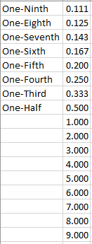
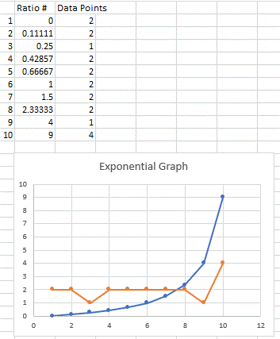

# Constant Sum (1 to 10) Analytical Hierarchy Process (AHP)
A constant sum AHP inspired by PhD level dissertation work. This is an iteration of student PhD project to assess Cybersecurity Readiness for the Energy Industry using expert opinions in pairwise comparisons to enable validation of experts consistency through hybrid techniques from both Hierarchical Decision Model (HDM) and AHP type calculations. This tool helps organizations evaluate their need to enhance cyber security controls. The tool is most suited for situtations where an outage is taking place within the organization. Note the 1 to 10 scale can create some misranking because it is a "proxy model" for the 1 to 17 AHP scale. See the Excel spreadsheet that is shown in this project files.  
 
---
HDM terminology used in this project compared to AHP  
Levels, HDM, AHP  
Level 1, Mission, Focus  
Level 2, Perspective, Actors  
Level 3, Criterion, Objectives  
Level 4, Alternative, Scenario  
***
What's new in this iteration?  
Step 1:  
Density - a customizable baseline measurement to make account of outliers  
Focus charts - deep dive reference when debating one individual implementation over another  
Skip level comparisons (Alternatives "Level 4" to Perspectives "Level 2")  
Step 2:  
Desirability Global Weights based on Perspectives weighting (rather than local weight mulitplication) from step 1  
New Sensitivity calculation
***
Note: The number of variables 4,5,6,7, and 11 have been put into the spreadsheet and tested. If you want to use variables matrices of 3, 8, 9, or 10 you will need to create that in the tool spreadsheet (work backwards from 11 and make space in the spreadsheet).  
***
Note: The reciprical scores on the grid tab are plus oned so that the total range is effectively larger* (yet the decision maker only gets a 1 to 10 scale to respond to). This tweak creates space in range which solves the AHP problem of mis-ranking/re-ranking the average vis-a-vis a raw sum (which would give a decision maker the wrong decision to choose). That is the grid is "expanded" to provide separation of scores thereby never changing rank order. Thus this CSAHP model raw sum will always equal the the ranking order.  
Example:  
If a cell score that is being inputed (there in only one value per pair because the reciprocal is derived), then the derived reciprocal is calculated based on the follwowing grid:  
Constant Sum Value: Grid Input Score, Reciprocal Derived  
1: 0, 9  
2: .11, 9  
3: .25, 4  
4: .42, 2.33  
5: .66, 1.5  
6: 1, 1  
7: 1.5, .66  
8: 2.33, .42  
9: 9, .11  
10: 9, 0  
The reasons for these scores is because of the (10-n)/n calculation for the reciprocal.  
Reviewing this grid setup shows that there are 20 possible grid data points from the 10 point scale:  
Constant sum scale in Excel  
1,	0   = 2 data points  
2,	0.11111   = 2 data points  
3,	0.25  = 1 data point  
4,	0.42857   = 2 data points  
5,	0.66667   = 2 data points  
6,	1   = 2 data points  
7,	1.5   = 2 data points  
8,	2.33333   = 2 data points  
9,	4   = 1 data point  
10,	9   = 4 data points  
Larger because effectively a 1 data point can be considered a minus 1 while the 4 data point can be considered a plus 2. If the 2 data points are all equal to one then the effective range is now 12 instead of 1 to 10.  
  
Note: A constant sum scale of 1 to 100 also provides enough room in the matrix to overcome the misranking problem but some survey tools (like Google Forms currently) will not allow for a 1 to 100 scale.
***
Note: The Alternatives (Level 4) are an optional component (and an additional spreadsheet for processing output of survey) of the model in order to include cost/aquisition decisions and management personnel into a final report.
